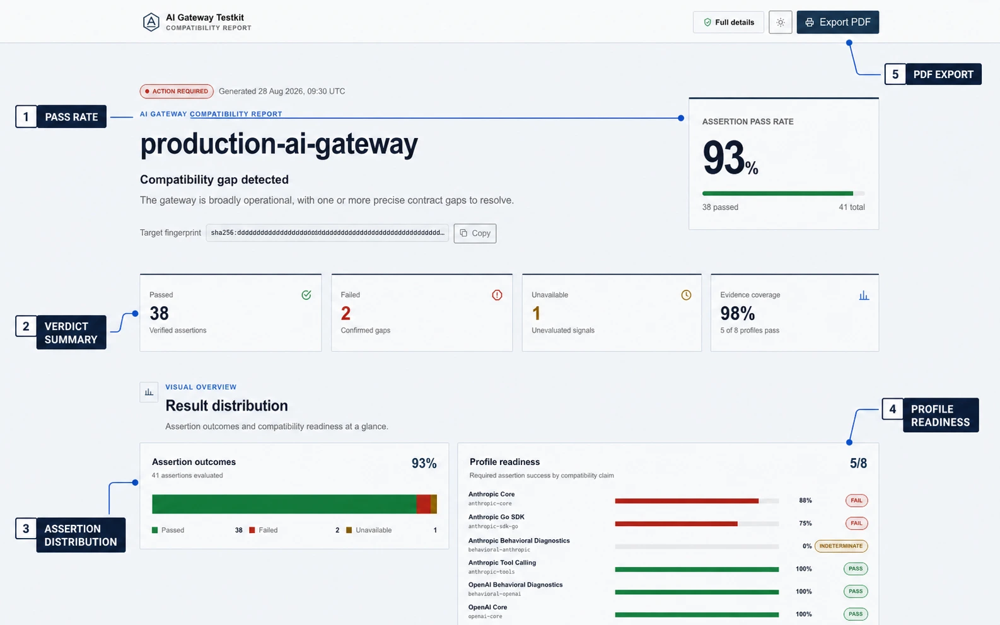

# AI Gateway Testkit

[](https://github.com/trungdlp/ai-gateway-testkit/actions/workflows/ci.yml)
[](go.mod)
[](LICENSE)

**Know what your AI gateway actually supports before your users find out.**

AI Gateway Testkit (`agtk`) is an open-source, black-box conformance and regression runner for Anthropic- and OpenAI-compatible gateways. It turns compatibility claims into repeatable test profiles, stable assertion IDs, CI-friendly verdicts, and canonical reports you can compare or safely share.



```text
gateway target + compatibility profile
                    |
                    v
           versioned test catalog
                    |
                    v
       protocol / SDK / agent checks
                    |
                    v
      PASS / FAIL / INDETERMINATE
                    |
                    v
        comparable canonical report
```

## Why `agtk`?

Claims of OpenAI or Anthropic compatibility can mean anything from basic authentication to full tool-calling and SDK interoperability. A successful request alone does not prove that a gateway is ready for production workloads.

`agtk` gives teams evidence they can act on:

- **Precise failures:** permanent scenario and assertion IDs such as `OAI-TOOL-001/A04`, instead of fragile log messages.
- **Explicit compatibility claims:** versioned profiles for core APIs, tool calling, official Go SDKs, behavioral diagnostics, Codex, and Claude Code.
- **Honest verdicts:** `FAIL` means observed incompatibility; missing or unavailable evidence becomes `INDETERMINATE`, never a false failure or pass.
- **Regression-ready reports:** compare two runs at assertion level and distinguish new failures from resolved or unchanged results.
- **Security-conscious execution:** environment-based credentials, HTTPS validation, bounded response bodies, redacted diagnostics, and sanitizable reports.
- **CI-friendly behavior:** deterministic ordering, bounded retries and costs, machine-readable JSON, and stable exit codes.

## What it tests

| Layer | Coverage | Profiles |
| --- | --- | --- |
| OpenAI protocol | Authentication, model discovery, non-streaming Responses, forced function calls | `oai-core`, `oai-tools` |
| Anthropic protocol | Authentication, model discovery, non-streaming Messages, forced tool use | `anthropic-core`, `anthropic-tools` |
| Official Go SDKs | Request and response interoperability through the official clients | `oai-sdk-go`, `anthropic-sdk-go` |
| Model behavior | Exact instruction-following diagnostics, kept separate from protocol claims | `behavioral-openai`, `behavioral-anthropic` |
| Coding agents | Non-interactive Codex and Claude Code workflows in disposable Docker Sandboxes | `codex-ready`, `claude-code-ready` |

Explore every executable contract with:

```sh
agtk profiles
agtk catalog list
agtk catalog show OAI-TOOL-001
```

The complete generated catalog is also available as [human-readable case documentation](docs/cases/) and [machine-readable JSON](catalog/cases/).

## Quick start

### 1. Install

Go 1.25 or newer is required.

```sh
go install github.com/trungdlp/ai-gateway-testkit/cmd/agtk@latest
```

Or build the project locally:

```sh
git clone https://github.com/trungdlp/ai-gateway-testkit.git
cd ai-gateway-testkit
make build
./bin/agtk version
```

### 2. Configure a target

Copy [examples/target.yaml](examples/target.yaml) and keep credentials in environment variables:

```yaml
name: staging
openai:
  base_url: https://gateway.example.com/v1
  model: openai-compatible-model
  credential_env: OPENAI_GATEWAY_API_KEY
anthropic:
  base_url: https://gateway.example.com/v1
  model: anthropic-compatible-model
  credential_env: ANTHROPIC_GATEWAY_API_KEY
  api_version: "2023-06-01"
```

```sh
export OPENAI_GATEWAY_API_KEY='...'
export ANTHROPIC_GATEWAY_API_KEY='...'
```

Configure only the protocol your gateway exposes. Credential values are never accepted as CLI flags or written to reports.

### 3. Run a compatibility profile

```sh
agtk run --target target.yaml \
  --profile oai-core,oai-tools \
  --profile anthropic-core,anthropic-tools
```

Create a canonical JSON report for CI or later comparison:

```sh
agtk run --target target.yaml \
  --profile oai-tools,anthropic-tools \
  --format json --output report.json
```

For a quick single-endpoint OpenAI run, the environment-only interface is still available:

```sh
export AI_GATEWAY_BASE_URL='https://gateway.example.com/v1'
export AI_GATEWAY_MODEL='your-model-id'
export AI_GATEWAY_API_KEY='your-api-key'

agtk run
```

## Understand the result

Each selected profile receives one readiness verdict:

| Verdict | Meaning |
| --- | --- |
| `PASS` | Every required assertion passed. |
| `FAIL` | At least one required assertion produced evidence of incompatibility. |
| `INDETERMINATE` | Required evidence was missing, errored, blocked, skipped, or not applicable. |

Reports expose **coverage** and **success** separately. This prevents unavailable evidence from masquerading as incompatibility, and prevents partial coverage from looking like a pass.

Exit codes are designed for automation:

| Code | Meaning |
| ---: | --- |
| `0` | Every selected profile passed. |
| `1` | At least one selected profile failed or was indeterminate. |
| `2` | Configuration, invocation, catalog, runner, or report I/O failed. |

## Catch regressions in CI

Keep a known report as your baseline, then annotate a new run:

```sh
agtk run --target target.yaml \
  --profile oai-tools \
  --baseline baseline.json \
  --format json --output current.json
```

Or compare two existing canonical reports directly:

```sh
agtk compare baseline.json current.json
```

Assertions are classified as `new_failure`, `resolved`, `unchanged_failure`, `unchanged_pass`, or `not_comparable`. Catalog digests prevent results from different executable contracts from being compared as if they were identical.

## Stable IDs, actionable evidence

Every scenario has a permanent ID, such as `OAI-RESP-001`, `ANT-TOOL-001`, or `CDX-EXEC-001`. Atomic assertions add a stable suffix, for example `OAI-RESP-001/A04`.

That identity stays useful across local debugging, CI, issue trackers, baselines, waivers, and release gates. Instead of saying that the response test broke, a team can identify the exact contract, profile version, scenario revision, and catalog digest that produced the result.

See [docs/architecture.md](docs/architecture.md) for the scenario, assertion, profile, report, and versioning model.

## Retries without hiding incompatibility

Transient transport failures and HTTP `408`, `425`, `429`, `500`, `502`, `503`, and `504` are retried twice by default with bounded exponential backoff. `Retry-After` is honored up to the configured maximum wait. Stable client, authentication, schema, and assertion failures are never retried.

```sh
agtk run --target target.yaml \
  --retries 3 \
  --retry-backoff 250ms \
  --retry-max-wait 5s
```

Recovered and exhausted retries are recorded in report provenance. Set `--retries 0` when duplicate inference cost is unacceptable.

## Agent readiness workflows

The experimental `codex-ready` and `claude-code-ready` profiles verify non-interactive coding workflows, including filesystem and shell effects. They require Docker Sandboxes (`sbx`) to be installed and authenticated:

```sh
agtk run --target target.yaml --profile codex-ready --agent-runner sbx
agtk run --target target.yaml --profile claude-code-ready --agent-runner sbx
```

Agent cases run against a disposable fixture, not this repository. They use a proxy-managed secret scoped to the sandbox and gateway host. Without `--agent-runner sbx`, agent assertions are skipped and the readiness verdict is `INDETERMINATE`.

## Reports and security

The canonical report schema is [schemas/report.schema.json](schemas/report.schema.json). Reports include runtime provenance, a secret-free target fingerprint, catalog version and digest, scenario revisions, assertion statuses and reason codes, profile verdicts, retry evidence, and bounded diagnostics.

Before sharing a report, sanitize it:

```sh
agtk report sanitize report.json > shareable.json
```

Sanitization removes endpoint URLs, model IDs, evidence, expected and observed values, and diagnostic messages. It is defense in depth, not a data-loss-prevention boundary: always use synthetic prompts and test credentials.

Render a polished, self-contained HTML report for stakeholders:

```sh
agtk report render report.json --output report.html
```

The HTML report works offline, includes accessible assertion-distribution and profile-readiness charts, responsive profile and scenario views, search and result filters, dark and light themes, and print-to-PDF styling. Rendering is share-safe by default and removes the same sensitive details as `report sanitize`. Use `--include-sensitive-details` only when the report will remain in a trusted environment and diagnostic evidence is required.

Remote targets require HTTPS by default; loopback HTTP remains available for local fixtures. OpenAI requests set `store: false`. See [SECURITY.md](SECURITY.md) to report a vulnerability.

## Contributing

Contributions that make gateway compatibility more measurable and reproducible are welcome. New protocol cases, provider reproductions, documentation, and focused bug fixes all help.

Start with [CONTRIBUTING.md](CONTRIBUTING.md). Before adding a scenario or changing report semantics, read [docs/architecture.md](docs/architecture.md). Every scenario lives in one independently reviewable Go file and generates one JSON artifact plus one Markdown document.

The local quality gate is intentionally offline and free of API charges:

```sh
go generate ./...
make check
```

`make check` verifies formatting, generated catalog integrity, static analysis, race-enabled tests, and the CLI build.

## License

Licensed under the [Apache License 2.0](LICENSE).
